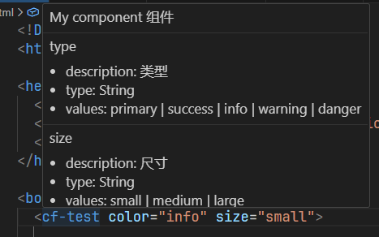
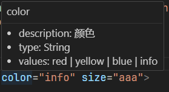
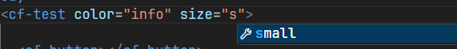

## Web Components 组件跳转到对应 js 文件, 显示注释信息及语法插件

### 跳转实现

- 组件名称必须和 js 文件名相同(使用 endsWith 匹配的);

### 组件 hover 提示信息(在没有 components.d.json 配置文件时)

- 支持显示组件对应的 js 文件里面(前 200 行代码)首个多行注释/\*\* 注释内容 \*/

## Web Components 语法

1. js-webComponents 创建 Web Components 模板

2. js-dispatchEvent 创建 dispatchEvent 模板

## components.d.json 自定义组件配置文件用于代码补全和提示, 组件名称支持多个用逗号分隔, attributes 会合并, description 会覆盖

```js
// components.d.json 类型定义
export type IComponentsTags = {
  // 组件名称
  [key: string]: {
    // 组件描述
    description: string,
    attributes: {
      // 属性名称
      [key: string]: {
        // 属性描述
        description: string,
        // 属性类型
        type: string,
        // 属性可选值
        values: (string | number)[],
      },
    },
  },
};
```

```json
// 例子
{
  "cf-test": {
    "description": "My component 组件",
    "attributes": {
      "type": {
        "description": "类型",
        "type": "String",
        "values": ["primary", "success", "info", "warning", "danger"]
      }
    }
  }
}
```







### 推荐插件 Web Components js 中显示更好看

1. es6-string-html [Tobermory]

2. Format Selection As HTML [Adrian Wilczyński]

3. Inline HTML [pushqrdx]
4. 在.vscode 中 settings.json 中添加配置 Emmet 语法提示

```
"emmet.includeLanguages": {
  "javascript": "html"
},
"emmet.syntaxProfiles": {
  "javascript": "html"
},
```

